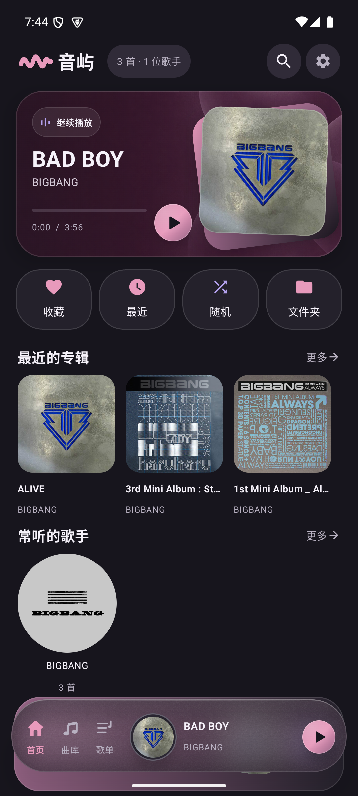
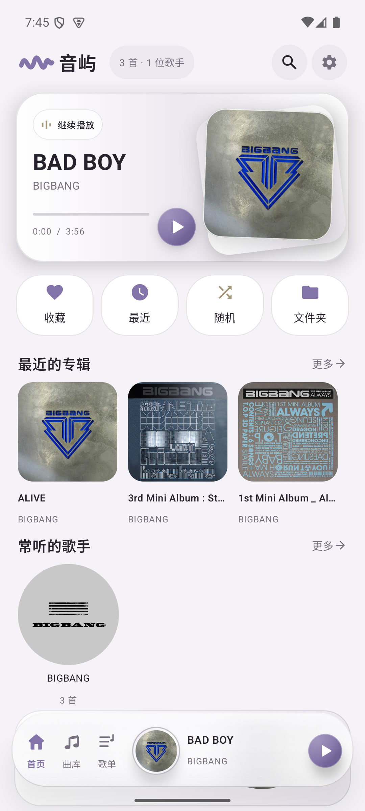
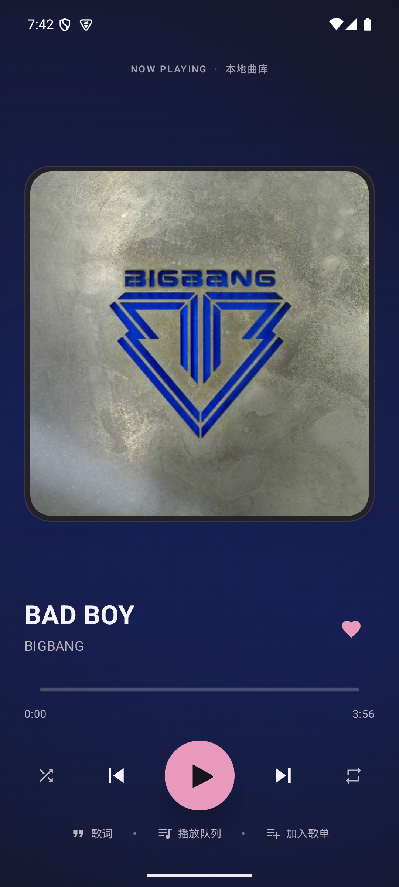
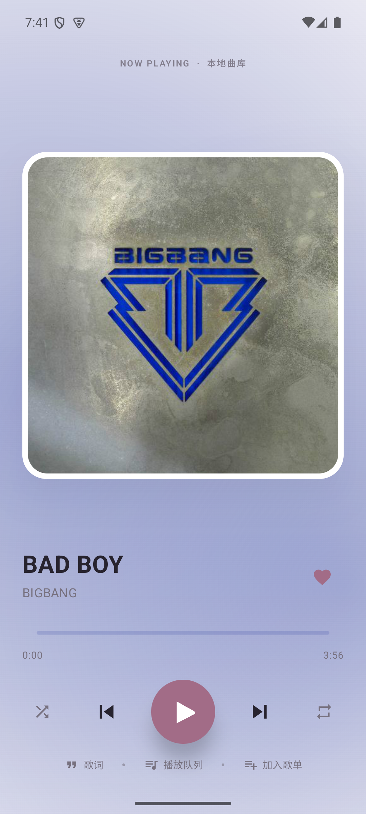

# 音屿 · YinYu

**Android 本地音乐播放器 · Android Local Music Player**<br>
当前版本 / Current version: **v1.0.0**

[简体中文](#简体中文) · [English](#english) · [日本語](#日本語) · [한국어](#한국어)

**🌐 项目展示页 / Project showcase:** [静态网页源码 `docs/index.html`](docs/index.html) · [应用截图](docs/screenshots/)

> 网页使用本地截图素材，无外部依赖。GitHub README 不会运行内嵌网页；如需独立在线网址，需要单独启用网站托管。

## 界面展示 · Screenshots

<div align="center">
<table>
  <tr>
    <td align="center"><strong>深色首页 · Dark Home</strong><br></td>
    <td align="center"><strong>浅色首页 · Light Home</strong><br></td>
  </tr>
  <tr>
    <td align="center"><strong>深色播放页 · Dark Player</strong><br></td>
    <td align="center"><strong>浅色播放页 · Light Player</strong><br></td>
  </tr>
</table>
</div>

---

## 简体中文

音屿是一款面向 Android 手机的离线音乐播放器。只扫描和播放设备上的本地音乐，无需账号、网络连接或广告。

### 功能

- 扫描本地歌曲，按歌曲、专辑、歌手、文件夹浏览。
- 播放、暂停、上一首、下一首、拖动进度、随机播放、循环播放。
- 后台播放、系统媒体通知和锁屏控制；拔出耳机时暂停。
- 收藏、最近播放、自建歌单和本地搜索。
- 全屏播放页、封面色调渐变背景、波浪进度条和本地 LRC 歌词。
- 深色、浅色主题与可选主题色。

### 在手机上使用

1. 将电脑上的 `E:\MyMusic` 复制到手机，例如 `内部存储/Music/MyMusic`。
2. 从 [v1.0.0 发布页](https://github.com/standkye/yinyu-android-music-player/releases/tag/v1.0.0)下载并安装 APK。
3. 首次打开时允许读取音频；也可以在应用中选择音乐文件夹并授权。

推荐的音乐文件夹结构：

```text
Music/MyMusic/
  歌手名/
    singer.jpg
    专辑名/
      folder.jpg
      歌曲.mp3
      歌曲.lrc
```

递归扫描格式：MP3、FLAC、M4A、AAC、OGG、Opus、WAV、AIFF、AMR。标题、歌手和专辑优先读取音频标签。专辑封面支持内嵌图片或同目录的 `folder.jpg`、`cover.jpg`、`front.jpg` 等；歌手文件夹中的 `singer.jpg` 用作歌手图片；与歌曲同名的 `.lrc` 文件用作歌词。媒体库扫描能读取歌曲和内嵌封面；如需读取文件夹里的歌词，请在设置中授权音乐文件夹。

### 构建

需要 JDK 17 和 Android SDK 36。在 Windows 项目目录运行：

```powershell
.\gradlew.bat :app:assembleDebug
```

APK 输出到 `app/build/outputs/apk/debug/app-debug.apk`。最低支持 Android 8.0（API 26）。应用不申请网络权限。系统媒体通知由 Android 和设备厂商绘制，显示样式可能因设备而异。

### 技术栈

Kotlin、Jetpack Compose、Material 3、AndroidX Media3 ExoPlayer、MediaSessionService、SQLite、MediaStore、Android 系统文件夹授权、Haze。

---

## English

YinYu is an offline music player for Android phones. It scans and plays audio stored on your device. No account, internet connection, or ads are required.

### Features

- Scan local music and browse by song, album, artist, or folder.
- Play and pause, skip tracks, seek, shuffle, and repeat.
- Background playback, system media notification, lock-screen controls, and pause on headphone disconnection.
- Favorites, recently played tracks, custom playlists, and local search.
- Full-screen player, album-color gradient background, wavy seek bar, and local LRC lyrics.
- Dark and light themes with selectable accent colors.

### Get started

1. Copy `E:\MyMusic` from your computer to your phone, for example `Internal storage/Music/MyMusic`.
2. Download and install the APK from the [v1.0.0 release](https://github.com/standkye/yinyu-android-music-player/releases/tag/v1.0.0).
3. Grant audio access on first launch, or select and authorize your music folder in the app.

Recommended folder layout:

```text
Music/MyMusic/
  Artist/
    singer.jpg
    Album/
      folder.jpg
      Track.mp3
      Track.lrc
```

Supported formats: MP3, FLAC, M4A, AAC, OGG, Opus, WAV, AIFF, and AMR. Track title, artist, and album are read from audio tags when available. Album art can be embedded or stored beside the tracks as `folder.jpg`, `cover.jpg`, or `front.jpg`. Put `singer.jpg` in an artist folder for its image, and use a same-name `.lrc` file for lyrics. Media-library scanning reads tracks and embedded artwork; grant folder access in Settings to load sidecar lyrics.

### Build

Requires JDK 17 and Android SDK 36. On Windows, run from the project directory:

```powershell
.\gradlew.bat :app:assembleDebug
```

The APK is written to `app/build/outputs/apk/debug/app-debug.apk`. Minimum supported version: Android 8.0 (API 26). The app requests no internet permission. Android and device manufacturers control the appearance of media notifications, so it may vary by device.

### Tech stack

Kotlin, Jetpack Compose, Material 3, AndroidX Media3 ExoPlayer, MediaSessionService, SQLite, MediaStore, Android's system folder picker, and Haze.

---

---

## 日本語

音屿（YinYu）は、Android スマートフォン向けのオフライン音楽プレーヤーです。端末内の音楽だけをスキャンして再生します。アカウント、インターネット接続、広告は必要ありません。

### 主な機能

- 端末内の音楽をスキャンし、曲・アルバム・アーティスト・フォルダー別に表示。
- 再生／一時停止、前後の曲へのスキップ、シーク、シャッフル、リピート。
- バックグラウンド再生、システム通知とロック画面での操作、イヤホンが外れたときの一時停止。
- お気に入り、最近再生した曲、プレイリスト作成、端末内検索。
- 全画面プレーヤー、アルバムカラーのグラデーション背景、波形シークバー、ローカル LRC 歌詞。
- ダーク／ライトテーマとアクセントカラーの選択。

### 使い方

1. パソコンの `E:\MyMusic` をスマートフォンにコピーします。例：`内部ストレージ/Music/MyMusic`。
2. [v1.0.0 リリースページ](https://github.com/standkye/yinyu-android-music-player/releases/tag/v1.0.0)から APK をダウンロードしてインストールします。
3. 初回起動時に音楽へのアクセスを許可するか、アプリ内で音楽フォルダーを選択して許可します。

推奨フォルダー構成：

```text
Music/MyMusic/
  アーティスト名/
    singer.jpg
    アルバム名/
      folder.jpg
      曲名.mp3
      曲名.lrc
```

対応形式：MP3、FLAC、M4A、AAC、OGG、Opus、WAV、AIFF、AMR。曲名・アーティスト名・アルバム名は、利用可能な場合は音声タグから取得します。アルバム画像は音声ファイル内の画像、または同じフォルダーの `folder.jpg`、`cover.jpg`、`front.jpg` などに対応します。アーティスト画像にはアーティストフォルダー内の `singer.jpg`、歌詞には曲と同じ名前の `.lrc` ファイルを使用します。メディアライブラリのスキャンでは曲と埋め込み画像を読み込みます。フォルダー内の歌詞を表示するには、設定から音楽フォルダーへのアクセスを許可してください。

### ビルド

JDK 17 と Android SDK 36 が必要です。Windows ではプロジェクトフォルダーから実行します。

```powershell
.\gradlew.bat :app:assembleDebug
```

APK は `app/build/outputs/apk/debug/app-debug.apk` に生成されます。Android 8.0（API 26）以降に対応します。アプリはインターネット権限を要求しません。メディア通知の表示は Android と端末メーカーによって異なります。

### 技術スタック

Kotlin、Jetpack Compose、Material 3、AndroidX Media3 ExoPlayer、MediaSessionService、SQLite、MediaStore、Android システムのフォルダー選択機能、Haze。

---

## 한국어

음屿(YinYu)는 Android 스마트폰용 오프라인 음악 플레이어입니다. 기기에 저장된 음악만 검색하고 재생합니다. 계정, 인터넷 연결, 광고가 필요하지 않습니다.

### 주요 기능

- 로컬 음악을 검색하고 곡·앨범·아티스트·폴더별로 탐색합니다.
- 재생 및 일시 정지, 이전·다음 곡, 탐색, 셔플, 반복 재생을 지원합니다.
- 백그라운드 재생, 시스템 미디어 알림과 잠금 화면 제어, 이어폰 분리 시 일시 정지를 지원합니다.
- 즐겨찾기, 최근 재생, 사용자 재생목록, 로컬 검색을 지원합니다.
- 전체 화면 플레이어, 앨범 색상 그라데이션 배경, 물결형 탐색 바, 로컬 LRC 가사를 제공합니다.
- 다크·라이트 테마와 강조 색상을 선택할 수 있습니다.

### 시작하기

1. 컴퓨터의 `E:\MyMusic` 폴더를 휴대폰으로 복사합니다. 예: `내부 저장소/Music/MyMusic`.
2. [v1.0.0 릴리스 페이지](https://github.com/standkye/yinyu-android-music-player/releases/tag/v1.0.0)에서 APK를 다운로드해 설치합니다.
3. 처음 실행할 때 오디오 접근을 허용하거나 앱에서 음악 폴더를 선택하고 권한을 부여합니다.

권장 폴더 구조:

```text
Music/MyMusic/
  아티스트/
    singer.jpg
    앨범/
      folder.jpg
      곡.mp3
      곡.lrc
```

지원 형식: MP3, FLAC, M4A, AAC, OGG, Opus, WAV, AIFF, AMR. 곡 제목, 아티스트, 앨범 정보는 가능한 경우 오디오 태그에서 가져옵니다. 앨범 이미지는 오디오 파일에 포함된 이미지 또는 같은 폴더의 `folder.jpg`, `cover.jpg`, `front.jpg` 등을 사용할 수 있습니다. 아티스트 이미지에는 아티스트 폴더의 `singer.jpg`를, 가사에는 곡과 이름이 같은 `.lrc` 파일을 사용합니다. 미디어 라이브러리 검색은 곡과 포함된 앨범 이미지를 읽습니다. 폴더 안의 가사를 읽으려면 설정에서 음악 폴더 접근을 허용하세요.

### 빌드

JDK 17과 Android SDK 36이 필요합니다. Windows에서는 프로젝트 폴더에서 실행하세요.

```powershell
.\gradlew.bat :app:assembleDebug
```

APK는 `app/build/outputs/apk/debug/app-debug.apk`에 생성됩니다. Android 8.0(API 26) 이상을 지원합니다. 앱은 인터넷 권한을 요청하지 않습니다. 미디어 알림 모양은 Android 버전과 기기 제조사에 따라 달라질 수 있습니다.

### 기술 스택

Kotlin, Jetpack Compose, Material 3, AndroidX Media3 ExoPlayer, MediaSessionService, SQLite, MediaStore, Android 시스템 폴더 선택기, Haze.

---

## 开源许可 · Open-source license

- **简体中文：**音屿原创代码采用 GNU GPL v3（SPDX：`GPL-3.0-only`），完整条款见 [`LICENSE`](LICENSE)。再发布本项目或其衍生版本时，请遵守 GPL v3 的条款。第三方依赖和素材仍按各自许可使用。
- **English:** YinYu's original code is licensed under GNU GPL v3 (SPDX: `GPL-3.0-only`). See [`LICENSE`](LICENSE) for the full terms. Redistributions and derivative works must comply with GPL v3. Third-party dependencies and assets remain under their respective licenses.
- **日本語：**音屿のオリジナルコードは GNU GPL v3（SPDX：`GPL-3.0-only`）で公開しています。全文は [`LICENSE`](LICENSE) をご覧ください。再配布や派生物には GPL v3 の条件が適用されます。サードパーティの依存関係と素材は、それぞれのライセンスに従います。
- **한국어:** YinYu의 자체 코드는 GNU GPL v3(SPDX: `GPL-3.0-only`)에 따라 공개됩니다. 전체 내용은 [`LICENSE`](LICENSE)에서 확인하세요. 재배포 및 파생물은 GPL v3 조건을 따라야 합니다. 서드파티 의존성과 에셋은 각자의 라이선스를 따릅니다.
